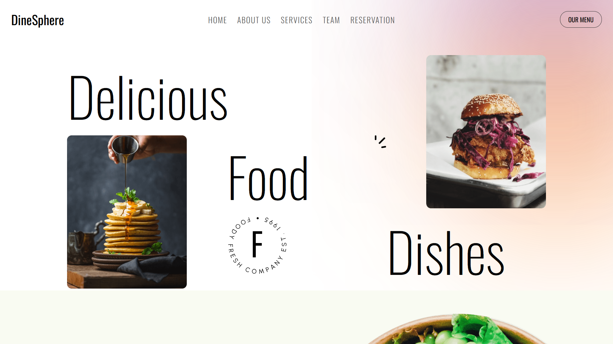
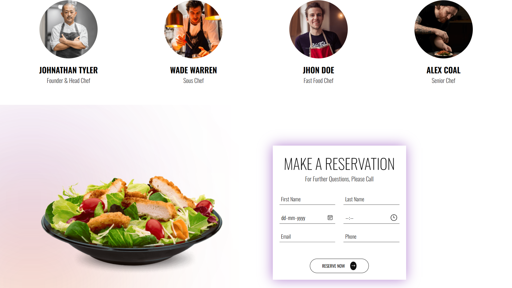

# 🍽️ DineSlot – Restaurant Reservation Website

This is a responsive restaurant reservation website built with **HTML**, **Tailwind CSS**, and **JavaScript**. 
It allows users to explore delicious food, view team chefs, and make table reservations online.

---

## 📸 Screenshots

### Hero Section


### Food Menu


### Reservation Form



## 🔧 Tech Used

- HTML5
- Tailwind CSS
- JavaScript

---

## 🚀 Features

- Responsive layout for all screen sizes
- Reservation form with name, date, time, and email fields
- Chef team showcase section
- Stylish hero section with images and gradients

---

## 📁 How to Run Locally

```bash
git clone https://github.com/nahida-athanikar/Restorant-Reservation.git
cd Restorant-Reservation
open index.html in your browser
```
## Frontend and Backend Command 
npm run dev and npm run start
---

## 📂 Folder Structure

```
Restorant-Reservation/
├── index.html
├── assets/
│   ├── css/
│   ├── js/
│   └── images/
├── snapshots/
│   ├── snapshot1.png
│   ├── snapshot2.png
│   └── snapshot3.png
└── README.md
```

---

## 🙋‍♀️ Author

**Nahida Athanikar Nadaf**  
📍 India  
🌐 [GitHub](https://github.com/nahida-athanikar)

